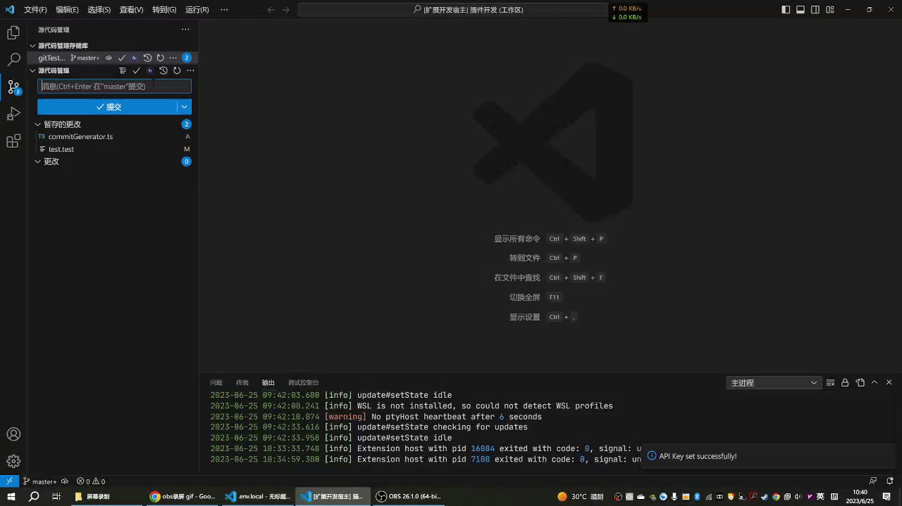

# ComitGen for VSCode

ComitGen 是一个 VSCode 扩展，使用先进的 OpenAI 技术，自动生成准确和描述性的 Git 提交信息，帮助你节省编写提交信息的时间。

[README-EN](./README.md) 中文

## 特性

- 使用 OpenAI 的技术自动生成 commit 消息。
- 可自定义的 commit 消息模板。
- 支持使用代理连接到 OpenAI API。
- 预设了遵循 AngularJS 提交消息风格的模板，以便在编写 commit 时遵循最佳实践。

## 开始使用

### 预备条件

- Visual Studio Code 1.79.0 或更高版本。
- Node.js 16 或更高版本。

### 安装

1. 打开 Visual Studio Code。
2. 访问扩展视图（`Ctrl+Shift+X`）。
3. 搜索 "Commit Message AI Generator"。
4. 点击安装。

### 使用

1. 在 VSCode 中打开你的 Git 仓库。
2. 对代码进行一些更改。
3. 打开源代码控制视图（`Ctrl+Shift+G`）。
4. 点击 "生成提交信息" 按钮。

### 设置

- `ComitGen.baseURL`：API 的基础 URL。如果需要，也可以指定一个代理 URL。
- `ComitGen.prompt`：生成到 OpenAI API 提示的模板。
- `ComitGen.assistantPrompt`：来自 OpenAI API 的响应模板。

## 命令

- `ComitGen.startGenCommitMessage`：为你的更改生成提交信息。
- `ComitGen.setApiKey`：设置你的 OpenAI API 密钥。
- `ComitGen.clearApiKey`：清除你存储的 OpenAI API 密钥。

## 贡献

我们非常欢迎你的任何贡献。

## 许可证

遵循 MIT 许可证。更多信息请查看 `LICENSE`。

## 联系

[wweggplant](mailto:weiainijiujiu@126.com)
项目链接：[https://github.com/wweggplant/ComitGen](https://github.com/wweggplant/ComitGen)
